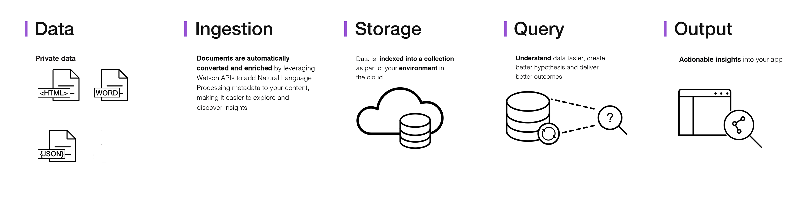

---

copyright:
  years: 2015, 2018
lastupdated: "2018-11-15"

---

{:shortdesc: .shortdesc}
{:new_window: target="_blank"}
{:tip: .tip}
{:pre: .pre}
{:codeblock: .codeblock}
{:screen: .screen}
{:note: .note}
{:important: .important}
{:javascript: .ph data-hd-programlang='javascript'}
{:java: .ph data-hd-programlang='java'}
{:python: .ph data-hd-programlang='python'}
{:swift: .ph data-hd-programlang='swift'}

# About

{{site.data.keyword.dcp_long}} makes it possible to rapidly build cognitive, cloud-based exploration applications that unlock actionable insights hidden in unstructured data, including your own proprietary data as well as public and third-party data.
{: shortdesc}

This is the architecture of a complete {{site.data.keyword.dcp_short}} service solution:

With {{site.data.keyword.dcp_short}}, it takes only a few steps to prepare your unstructured data, create a query that will pinpoint the information you need, and then integrate those insights into your new application or existing solution.

{{site.data.keyword.dcp_short}} works by using data analysis combined with cognitive intuition to take your unstructured data and enrich it so you can discover the information you need.

{{site.data.keyword.dcp_long}} brings together a functionally rich set of integrated, automated {{site.data.keyword.watson}} APIs to:

- Convert, enrich, and normalize data.
- Securely explore your proprietary content as well as free and licensed public content.
- Simplify development while still providing direct access to APIs.

For information about {{site.data.keyword.icpfull_notm}}, see the [{{site.data.keyword.icpfull_notm}} overview ](https://www.ibm.com/support/knowledgecenter/SSBS6K_3.1.0/getting_started/overview.html){: new_window}.

## Watson Assistant Discovery Extension tooling
{: #discovery-tooling}

The {{site.data.keyword.dcp_short}} service includes a complete set of online tools, the {{site.data.keyword.dcp_short}} tooling, to help you quickly set up an instance of the service and populate it with data.

The {{site.data.keyword.dcp_short}} service tooling has been designed to save time by eliminating the need to use APIs to populate your service. This lets your application developers concentrate on creating high-value ways for end users to experience the {{site.data.keyword.dcp_short}} service. See [Getting started with the tooling](/docs/services/discovery-icp/getting-started-tool.html) for an introduction to the {{site.data.keyword.dcp_short}} tooling.

## Next steps
{: #next-steps}

- Get started with either the {{site.data.keyword.dcp_short}} API or the {{site.data.keyword.dcp_short}} tooling:
    - [Getting started with the {{site.data.keyword.dcp_short}} API](/docs/services/discovery-icp/getting-started.html)
    - [Getting started with the {{site.data.keyword.dcp_short}} tooling](/docs/services/discovery-icp/getting-started-tool.html)
- The {{site.data.keyword.dcp_short}} service supports a number of SDKs to simplify the development of applications. The SDKs are available for many popular programming languages and platforms, including Node.js, Java, and Python. All SDKs are available from the [watson-developer-cloud namespace ](https://github.com/watson-developer-cloud){: new_window} on GitHub.
    - For a complete list of SDKs and information about using them, see [{{site.data.keyword.watson}} SDKs](https://console.bluemix.net/docs/services/watson/getting-started-sdks.html#sdks).
    - For detailed information about all methods of the Node, Java, and Python SDKs, see the [API reference ](https://console.bluemix.net/apidocs/discovery-icp){: new_window}.